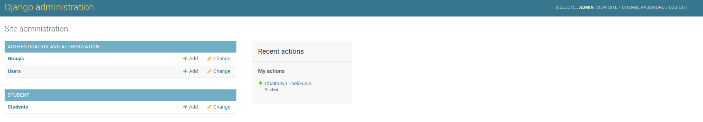

# What is Django?
Django is a Python framework that makes it easier to create web sites using Python.

Django takes care of the difficult stuff so that you can concentrate on building your web applications.

Django emphasizes reusability of components, also referred to as DRY (Don't Repeat Yourself), and comes with ready-to-use features like login system, database connection and CRUD operations (Create Read Update Delete).

Django is especially helpful for database driven websites.

# How does Django Work?
Django follows the MVT design pattern (Model View Template).

* Model - The data you want to present, usually data from a database.
* View - A request handler that returns the relevant template and content - based on the request from the user.
* Template - A text file (like an HTML file) containing the layout of the web page, with logic on how to display the data.


# Your First Django Project

The first step is to start a new Django project. Basically, this means that we'll run some scripts provided by Django that will create the skeleton of a Django project for us. This is just a bunch of directories and files that we will use later.

The names of some files and directories are very important for Django. You should not rename the files that we are about to create. Moving them to a different place is also not a good idea. Django needs to maintain a certain structure to be able to find important things.

If you haven't already, log in to the scripts docker container before running the next commands.

```shell
django-admin startproject django_app .
```

django-admin is a script that will create the directories and files for you.

In settings.py, find the line that contains TIME_ZONE and modify it to choose your own timezone. For example:

```python
TIME_ZONE = 'UTC'
```

There's a lot of different database software that can store data for your site. We'll use the Postgres database we had created earlier.

settings.py
```python
import os
DATABASES = {
    'default': {
        'ENGINE': 'django.db.backends.postgresql',
        'NAME': os.environ['POSTGRES_DB'],
        'USER': os.environ['POSTGRES_USER'],
        'PASSWORD': os.environ['POSTGRES_PASSWORD'],
        'HOST': os.environ['POSTGRES_HOST'],
        'PORT': os.environ['POSTGRES_PORT'],
    }
}
```
To create a database for our webapp, let's run the following in the console: (we need to be in the app directory that contains the manage.py file). 
```shell
python manage.py migrate
```

If that goes well, you should see something like this:
```
/app # python manage.py migrate
Operations to perform:
  Apply all migrations: admin, auth, contenttypes, sessions
Running migrations:
  Applying contenttypes.0001_initial... OK
  Applying auth.0001_initial... OK
  Applying admin.0001_initial... OK
  Applying admin.0002_logentry_remove_auto_add... OK
  Applying admin.0003_logentry_add_action_flag_choices... OK
  Applying contenttypes.0002_remove_content_type_name... OK
  Applying auth.0002_alter_permission_name_max_length... OK
  Applying auth.0003_alter_user_email_max_length... OK
  Applying auth.0004_alter_user_username_opts... OK
  Applying auth.0005_alter_user_last_login_null... OK
  Applying auth.0006_require_contenttypes_0002... OK
  Applying auth.0007_alter_validators_add_error_messages... OK
  Applying auth.0008_alter_user_username_max_length... OK
  Applying auth.0009_alter_user_last_name_max_length... OK
  Applying auth.0010_alter_group_name_max_length... OK
  Applying auth.0011_update_proxy_permissions... OK
  Applying auth.0012_alter_user_first_name_max_length... OK
  Applying sessions.0001_initial... OK

```

We can start the web server by running the following command:

```shell
python manage.py runserver 0:8000
```

# Django Models

To keep everything tidy, we will create a separate application inside our project. It is very nice to have everything organized from the very beginning. To create an application we need to run the following command in the console (from app directory where manage.py file is):

```shell
python manage.py startapp student
```

Since we already have the application, you will get an conflict error. The directories and files in the application should look like this:
```
app/
    django_app/
    manage.py
    student/
        admin.py
        apps.py
        migrations/
        models.py
```

After creating an application, we also need to tell Django that it should use it. We do that in the file django_app/settings.py -- open it in your code editor. We need to find INSTALLED_APPS and add a line containing 'student', just above ]. So the final product should look like this:

```python
INSTALLED_APPS = [
    'django.contrib.admin',
    'django.contrib.auth',
    'django.contrib.contenttypes',
    'django.contrib.sessions',
    'django.contrib.messages',
    'django.contrib.staticfiles',
    'student',
]
```

In the student/models.py file we define all objects called Models – this is a place in which we will define our student database.

Let's open student/models.py in the code editor, remove everything from it, and write code like this:

```python
from django.db import models


class Student(models.Model):
    first_name = models.CharField(max_length=15)
    last_name = models.CharField(max_length=15)
    age = models.IntegerField()
    phone = models.IntegerField()

    def __str__(self):
        return f"{self.first_name} {self.last_name}"

```

# Django Admin

To add, edit and delete the posts we've just modeled, we will use Django admin.

Let's open the student/admin.py file in the code editor and replace its contents with this:

```python
from django.contrib import admin
from .models import Student
admin.site.register(Student)
```

Run the following commands to model migrations:
```
python manage.py makemigrations
python manage.py migrate
```

Remember to run `python manage.py runserver 0:8000` in the console to run the web server.

To log in, you need to create a superuser - a user account that has control over everything on the site. Go back to the command line, and execute the following command:

```shell
python manage.py createsuperuser
```

When prompted, type your username (lowercase, no spaces), email address, and password. Don't worry that you can't see the password you're typing in – that's how it's supposed to be. Type it in and press enter to continue.

# Adding a new Student into the DB

Now let us add a new student information to the student DB. For that start the django server by running `python manage.py runserver 0:8000` if it's not already running. Then head over to [http:localhost:8000/admin](http:localhost:8000/admin). Enter the admin credentials that you just created and log in. You should see the admin home page which looks like this:


Now to add a new entry to the student, click on 'Students' and then 'Add Student' on the top right. (Or just click the '+' next to 'Students'). Enter your details here and save.

You can do all the CRUD operations here from the django admin panel itself. In the student list view you can see the student name which you just entered. Now you can just see the first_name of the student, let us add more columns in the list view. For that we will have to add a class in the student/admin.py.

```
from django.contrib import admin
from .models import Student

class StudentAdmin(admin.ModelAdmin):
    list_display = ('first_name', 'last_name', 'age','phone')
    search_fields = ['first_name', 'phone']

admin.site.register(Student, StudentAdmin)
```

## Viewing the data on the DB:

You can log into the Postgres DB container and access the shell to view the DB. Log into the Postgres container.

Then login to Postgres by running `PGPASSWORD=$POSTGRES_PASSWORD psql -U $POSTGRES_USER`

Here you can run `\l` to list all the databases. Use the student_db by `\c student_db`

Then you can run `select * from student_student;` to get a list of all the entries in the student_student table.
```
student_db=# select * from student_student;
 id |   first_name   |   last_name   | age |   phone   
----+-----------+-----------+-----+-----------
  2 | Chaitanya | Thekkunja |  23 | 576576878
(1 row)

```