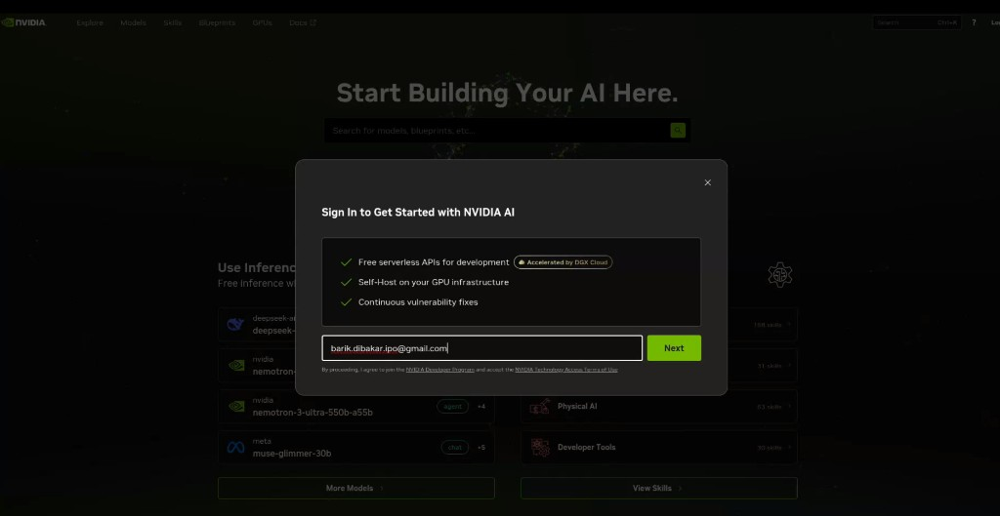
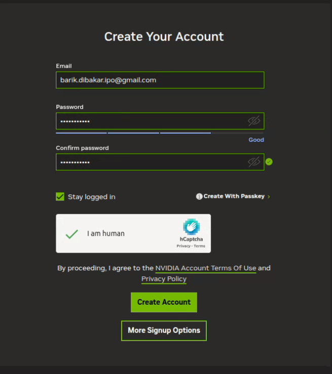
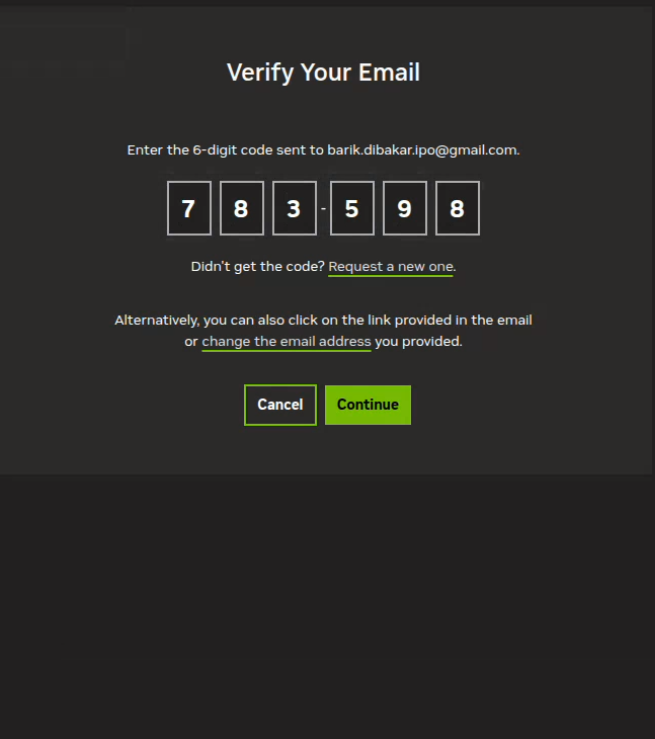
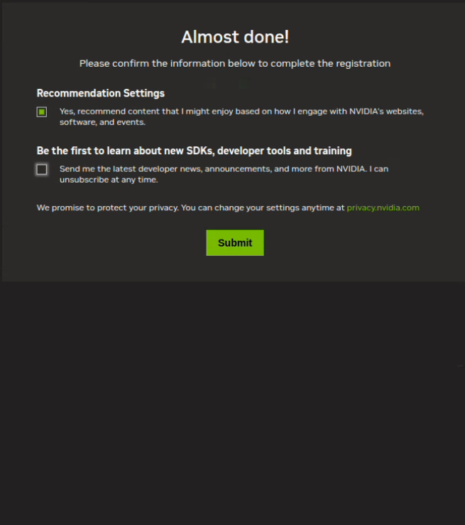
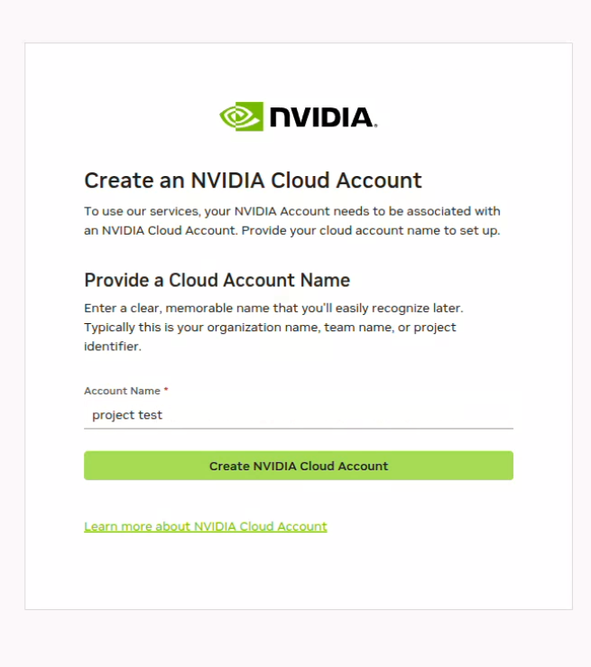
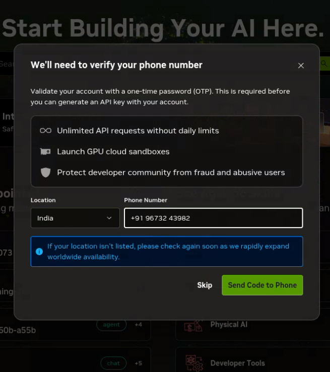
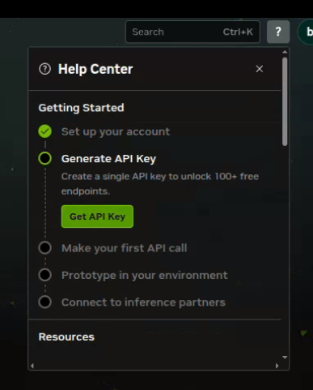
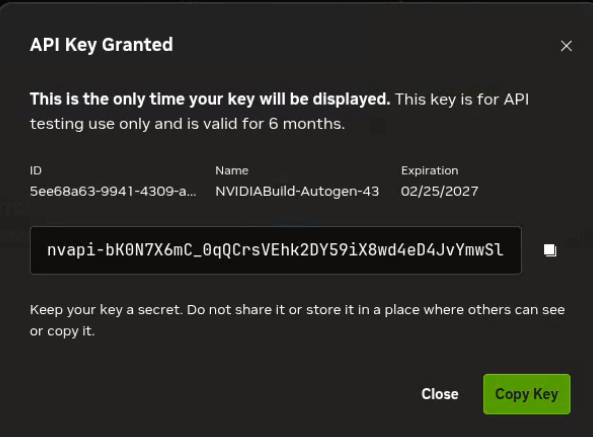

# Configure NVIDIA (build.nvidia.com)

Set up an NVIDIA developer account and generate an API key for the workshop.

> **Security:** Your API key is shown only once. Copy it somewhere safe (e.g. a local `.env` file). Never commit the real key to git or share screenshots that show the full key.

---

## Step 1 — Open the sign-in page

Go to: [https://build.nvidia.com/models?modal=signin](https://build.nvidia.com/models?modal=signin)

---

## Step 2 — Enter your email

Enter your email address to start sign-up.

---

## Step 3 — Create your account and verify email

1. Fill in the account details (email and password).
2. Complete the CAPTCHA and create the account.
3. Enter the 6-digit OTP sent to your email.

---

## Step 4 — Recommendation settings

Confirm the recommendation settings, then click **Submit**.

---

## Step 5 — Create an NVIDIA Cloud Account

Provide a clear account name (organization, team, or project), then click **Create NVIDIA Cloud Account**.

---

## Step 6 — Verify your phone number

Enter your phone number and complete OTP verification (required before generating an API key).

---

## Step 7 — Generate an API key

Open the Help Center and click **Get API Key**.

---

## Step 8 — Copy the generated key

Copy the key immediately and store it securely. You will not be able to view it again.

---

## Done

You now have:

- An NVIDIA developer / cloud account
- A valid API key for workshop use

Keep the key private and rotate it if it is ever exposed.
