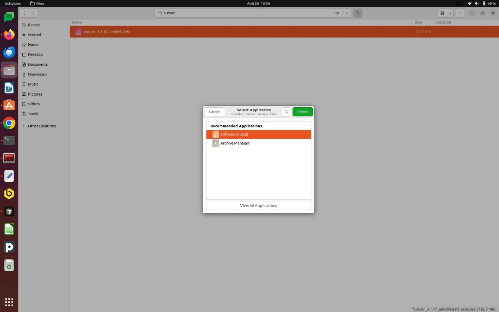

## METHOD-1 (download `.deb`)

Prefer a graphical install? Use the official Linux package from the Cursor website.

1. Open [https://cursor.com/download](https://cursor.com/download).
2. Click **Download for Linux** (choose the `.deb` build that matches your machine, usually **Linux .deb (x64)**).
3. When the download finishes, open your **Downloads** folder.
4. Right-click the downloaded `.deb` file (for example `cursor_3.1.17_amd64.deb`).
5. Choose **Open With → Software Install**.
6. In the **Select Application** dialog, pick **Software Install**, then click **Select**.

   

7. Click **Install** and enter your password if prompted.

When installation completes, launch Cursor from **Applications → Cursor**, or run `cursor` in a terminal.


---

# METHOD-2 (Debian / Ubuntu)

You can install Cursor with the **APT repository** (steps below) or the **simple method** (download the `.deb` and install with Software Install at the end of this guide).

## 1. Update the system

```bash
sudo apt update
sudo apt upgrade -y
```

## 2. Install required packages

```bash
sudo apt install -y curl gpg
```

## 3. Add Cursor’s GPG key

```bash
curl -fsSL https://downloads.cursor.com/keys/anysphere.asc | \
gpg --dearmor | \
sudo tee /etc/apt/keyrings/cursor.gpg > /dev/null
```

## 4. Add the Cursor APT repository

```bash
echo "deb [arch=amd64,arm64 signed-by=/etc/apt/keyrings/cursor.gpg] https://downloads.cursor.com/aptrepo stable main" | \
sudo tee /etc/apt/sources.list.d/cursor.list > /dev/null
```

These GPG key and repository commands match Cursor’s current Debian/Ubuntu documentation.

## 5. Refresh APT

```bash
sudo apt update
```

## 6. Install Cursor

```bash
sudo apt install -y cursor
```

## 7. Launch Cursor

From the app menu: **Applications → Cursor**

Or from a terminal:

```bash
cursor
```

## 8. Verify the installation

```bash
which cursor
```

You should see a path similar to:

```text
/usr/bin/cursor
```

Then check the version:

```bash
cursor --version
```


