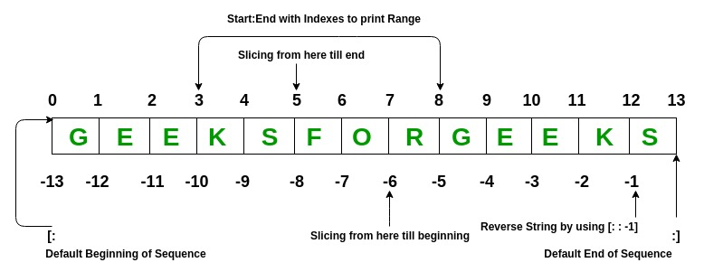

# Data Structures in Python
Data Structures are a way of organizing data so that it can be accessed more efficiently depending upon the situation. Data Structures are fundamentals of any programming language around which a program is built. 

## Lists:
Python Lists are just like the arrays, declared in other languages which is an ordered collection of data. It is very flexible as the items in a list do not need to be of the same type.

We can create a list in python as shown below.
```python
my_list = [1, 2,  3, "GFG", 2.3]
```
List elements can be accessed by the assigned index. In python starting index of the list, sequence is 0 and the ending index is (if N elements are there) N-1.


### Python List Operations

```python

# Creating a List with 
# the use of multiple values 
List = ["Python", "Git", "Docker"] 
print("\nList containing multiple values: ") 
print(List)
  
# Creating a Multi-Dimensional List 
# (By Nesting a list inside a List) 
List2 = [['Python', 'Git'], ['Docker']] 
print("\nMulti-Dimensional List: ") 
print(List2) 
  
# Accessing a element from the List 
# using index number 
print("Accessing element from the list") 
print(List[0])  
print(List[2]) 
  
# Accessing a element using 
# negative indexing 
print("Accessing element using negative indexing") 
print(List[-1]) # print the last element of list 
      
# print the third last element of list  
print(List[-3])
```
## Dictionary:

Python dictionary is like hash tables in any other language with the time complexity of O(1). It is an unordered collection of data values, used to store data values like a map, which, unlike other Data Types that hold only a single value as an element, Dictionary holds the key:value pair. Key-value is provided in the dictionary to make it more optimized. 

Indexing of Python Dictionary is done with the help of keys. These are of any hashable type i.e. an object whose can never change like strings, numbers, tuples, etc. We can create a dictionary by using curly braces ({}) or dictionary comprehension.

### Python Dictionary Operations

```python
# Creating a Dictionary
Dict = {'Name': 'Python', 1: [1, 2, 3, 4]}
print("Creating Dictionary: ")
print(Dict)
  
# Accessing a element using key 
print("Accessing a element using key:") 
print(Dict['Name']) 
  
# Accessing a element using get() method 
print("Accessing a element using get:") 
print(Dict.get(1)) 
  
# Creation using Dictionary comprehension
myDict = {x: x**2 for x in [1,2,3,4,5]}
print(myDict)
```

## Tuple:
Python Tuple is a collection of Python objects much like a list but Tuples are immutable in nature i.e. the elements in the tuple cannot be added or removed once created. Just like a List, a Tuple can also contain elements of various types.

In Python, tuples are created by placing a sequence of values separated by ‘comma’ with or without the use of parentheses for grouping of the data sequence.

Note: Tuples can also be created with a single element, but it is a bit tricky. Having one element in the parentheses is not sufficient, there must be a trailing ‘comma’ to make it a tuple.

### Python Tuple Operations
```python
# Creating a Tuple with the use of strings
Tuple = ('Python', 'Git')
print("\nTuple with the use of string: ")
print(Tuple)
      
# Creating a Tuple with the use of list
list1 = [1, 2, 4, 5, 6]
print("\nTuple using List: ")
Tuple = tuple(list1)
  
# Accessing element using indexing
print("First element of tuple")
print(Tuple[0])
  
# Accessing element from last negative indexing
print("\nLast element of tuple")
print(Tuple[-1])
    
print("\nThird last element of tuple")
print(Tuple[-3])
```
## Set:

Python Set is an ordered collection of data that is mutable and does not allow any duplicate element. Sets are basically used to include membership testing and eliminating duplicate entries. The data structure used in this is Hashing, a popular technique to perform insertion, deletion, and traversal in O(1) on average. 

If Multiple values are present at the same index position, then the value is appended to that index position, to form a Linked List. In, CPython Sets are implemented using a dictionary with dummy variables, where key beings the members set with greater optimizations to the time complexity.

### Python Set Operations

```python

# Creating a Set with  a mixed type of values (Having numbers and strings) 
Set = set([1, 2, 'Python', 4, 'Git', 6, 'Docker']) 
print("\nSet with the use of Mixed Values") 
print(Set) 

# Creating a Set with same values repeated
Set = set([1, 2, 'Python', 4, 'Git', 6, 'Docker',  6, 'Docker']) 
print("\nSet with the use of Mixed Values") 
print(Set) 
  
# Accessing element using for loop 
print("\nElements of set: ") 
for i in Set: 
    print(i, end =" ") 
print()
  
# Checking the element using in keyword 
print("Python" in Set)
```
## String:

Python Strings are arrays of bytes representing Unicode characters. In simpler terms, a string is an immutable array of characters. Python does not have a character data type, a single character is simply a string with a length of 1.

Note: As strings are immutable, modifying a string will result in creating a new copy.

### Python Strings Operations
```python
String = "Welcome to Workshop"
print("Creating String: ") 
print(String) 
      
# Printing First character 
print("\nFirst character of String is: ") 
print(String[0]) 
      
# Printing Last character 
print("\nLast character of String is: ") 
print(String[-1])
```

These are some basic python data structures. However, other than these there are a number of other data structures that are present in python.


